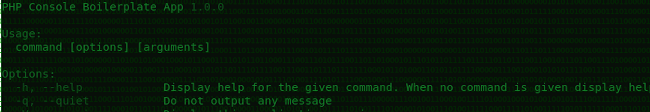
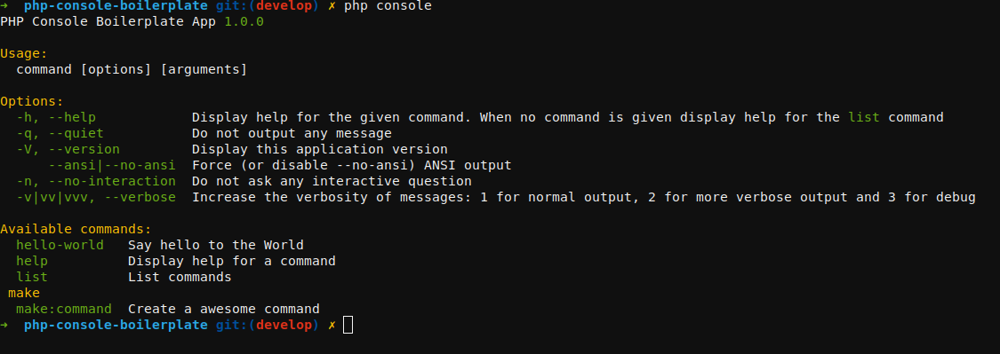
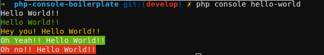
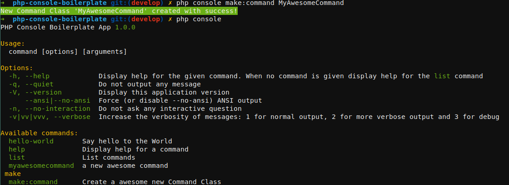

# PHP  Console Boilerplate



A boilerplate to PHP Console App like artisan [Laravel](https://github.com/laravel/laravel).

Based on awesome project live coding of @nunomaduro on Laracon Online 2021 [click here to see](https://www.youtube.com/watch?v=ps9oNo3XA4U).

## Dependencies
--------------

- [Synfony Console](https://github.com/symfony/console)
- [Collision](https://github.com/nunomaduro/collision)

## Usage
--------

### 1. See the options and available commands
  ```hell
    php console
  ``` 
  

### 2. Run Hello World Command Example
  ```shell
    php console hello-world
  ```
  
### 3. Output color styles available:

  ```php
  ...
    $this->ln('Hello World!!');
    $this->info('Hello World!!');
    $this->warning('Hey you! Hello World!!');
    $this->success('Oh Yeah!! Hello World!!');
    $this->error('Oh no!! Hello World!!');
  ...

  ```
### 4. Create a new Command
  ```shell
    php console make:command MyAwesomeCommand
  ```
   

  Adjust the command name, description, configurations and add the logic command:

  ```php
  <?php

  namespace PhpConsoleBoilerplate\Console\Commands;

  use PhpConsoleBoilerplate\Console\AbstractCommand;
  use Symfony\Component\Console\Input\InputInterface;

  class MyAwesomeCommand extends AbstractCommand
  {
    protected $name = 'myawesomecommand'; // command

    protected $description = 'a new awesome command'; // command description
    
    protected function configure(): void
    {
      // configure your command here ...
    }

    public function handle(InputInterface $input)
    {
      $this->info('Starting Command execution');
      // command logic here ...
    }
  }
  ```
  


## Credits
----------

 Thank You(Obrigado) @nunomaduro
